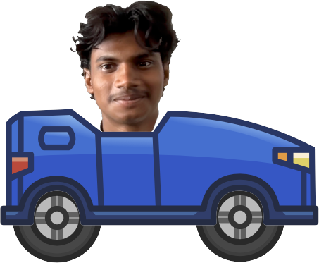

# Hill Climber Mani

A physics-based 2D driving game built with Godot Engine featuring procedural terrain, vehicle upgrades, collectible coins & gems, and custom character driver physics.

---

## 🚗 Features
- **Custom Driver Character**: Physics-driven ragdoll driver head that reacts dynamically to gravity, acceleration, and terrain collisions.
- **Vehicle Customization & Upgrades**: Engine power, wheel size, suspension stability, fuel capacity, and center of mass adjustments in the Garage.
- **Dynamic Terrain & Maps**: Multiple challenging levels including Countryside, Desert, Highway, Mountain, Cliff, and Nirvana.
- **Collectibles**: Pick up fuel cans to stay moving, collect coins & gems for upgrades.

---

## 🎮 Controls

| Action | Key / Input |
| :--- | :--- |
| **Accelerate / Tilt Back** | `D` / `Right Arrow` / Gas Pedal |
| **Brake / Reverse / Tilt Forward** | `A` / `Left Arrow` / Brake Pedal |
| **Pause** | `Esc` |

---

## 🛠️ Built With
- **Godot Engine 4.2+** (GDScript)

---

## 📜 License
This project is licensed under the [MIT License](./LICENSE).

